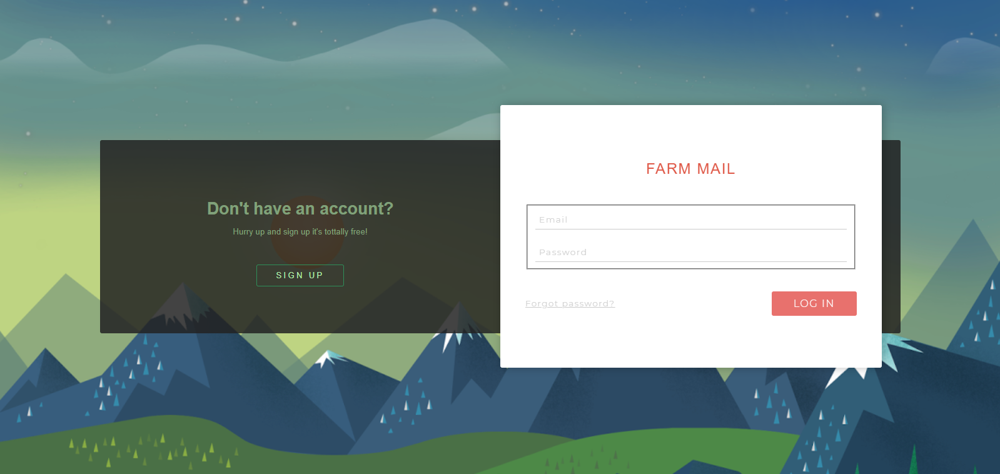
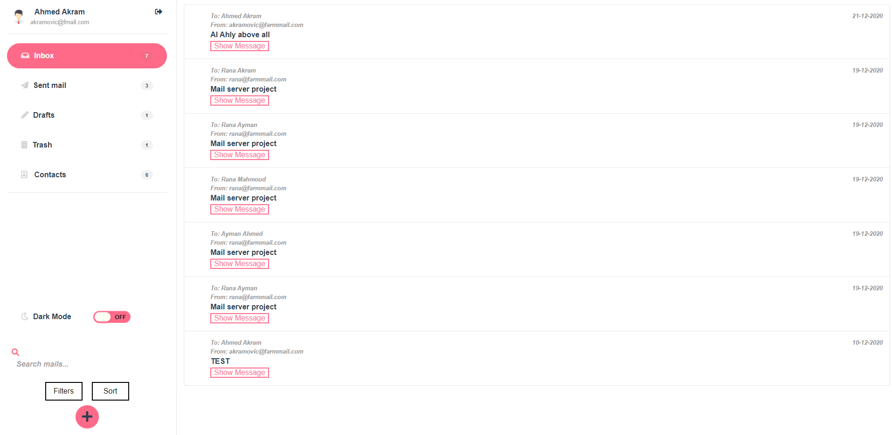
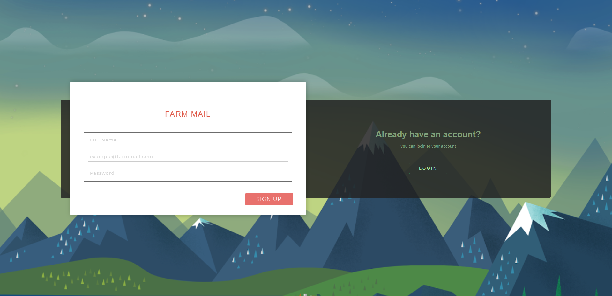
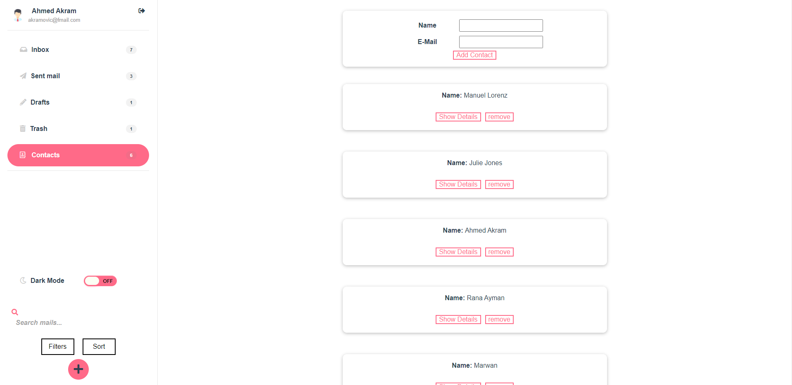
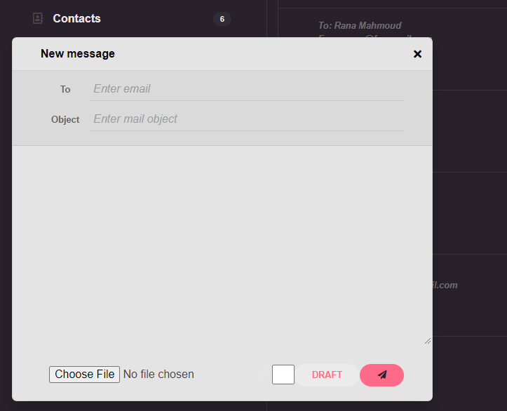

# MailClient-Vue.js-SpringBoot
MailClient WebApp using Vue.js for front-end and SpringBoot for backend




## Option
* Inbox Folder 
* Sent Mail Folders
* Drafts Folder 
* Trash Folders
* Contacts Folder
* Search , Filter and Sort mails
* Compose A New Mail
* Dark Mode


## Project setup

```
npm install
```

### Compiles and hot-reloads for development

```
npm run serve
```

### Compiles and minifies for production

```
npm run build
```

### Lints and fixes files

```
npm run lint
```

### Customize configuration

See [Configuration Reference](https://cli.vuejs.org/config/).


## Details about the App
* Sign UP
  * Sign Up screen required:
    * your full name
    * your email in form: example@farmmail.com
    * your password
    
* 

* Login
  * Login screen required:
    * your email ex : akramovic@farmmail.com
    * you password
    
* 


* Inbox Mail
  * Inbox folder contains incoming mails and shows the name of sender, Date, Time, and Subject of each incoming mail.
  * Each mail has a "Show Message" button you can click it to show the whole body of the mail and any attached files & a "Hide Message" button to hide the mail's details.

* 


* Sent Mail
  * Sent Mail folder contains outgoing mails and shows the name of receiver, Date , Time, and Subject of each outgoing mail.
  * Each mail has a "Show Message" button you can click it to show the whole body of the mail and any attached files & a "Hide Message" button to hide the mail's details.
* Drafts
  * Contains these mails that you wrote but didn't send ,so you can keep them until the appropriate time to send them.
  * you can delete any draft any time If you don't need it anymore.
  * Every Draft mail has a small styled circle shows it's priority.
* Trash
  * Contains mails those you deleted before and don't need them anymore.
  * Auto delete mail after 30 days.
* Contacts
  * You can save contacts of your friends those are already registered to our app.
  * You can save a contact by entering only the email of the registered user and we will match his name with this email.
  contacts
  
* 


* Compose new mail
  * you can send new message from + button in screen
  * message required: 1-sender email 2-object
  * its optional to set priority and its default at 5
  * you can send any attachment you want
  * you can save message in draft using draft button
  * if you choose X it will close only compose screen but it will save message to continue any time

* 
  
  
* Search
  * you can use search only without any filter to search about any words in messages field
  * there 5 filters:
    * filter by sender
    * filter by receiver
    * filter by subject
    * filter by date
    * filter by priority
  * you must type the word you want to search first then choose the filter from drop down filter menu
* Sort 
  * there 5 sort types
    * Sort by sender
    * Sort by receiver
    * Sort by subject
    * ort by date
    * Sort by priority
* Dark Mode
  * Dark mode skin to save our eye in night
  
* 


## Contributing
Pull requests are welcome. For major changes, please open an issue first to discuss what you would like to change.

## License
[MIT](https://choosealicense.com/licenses/mit/)
